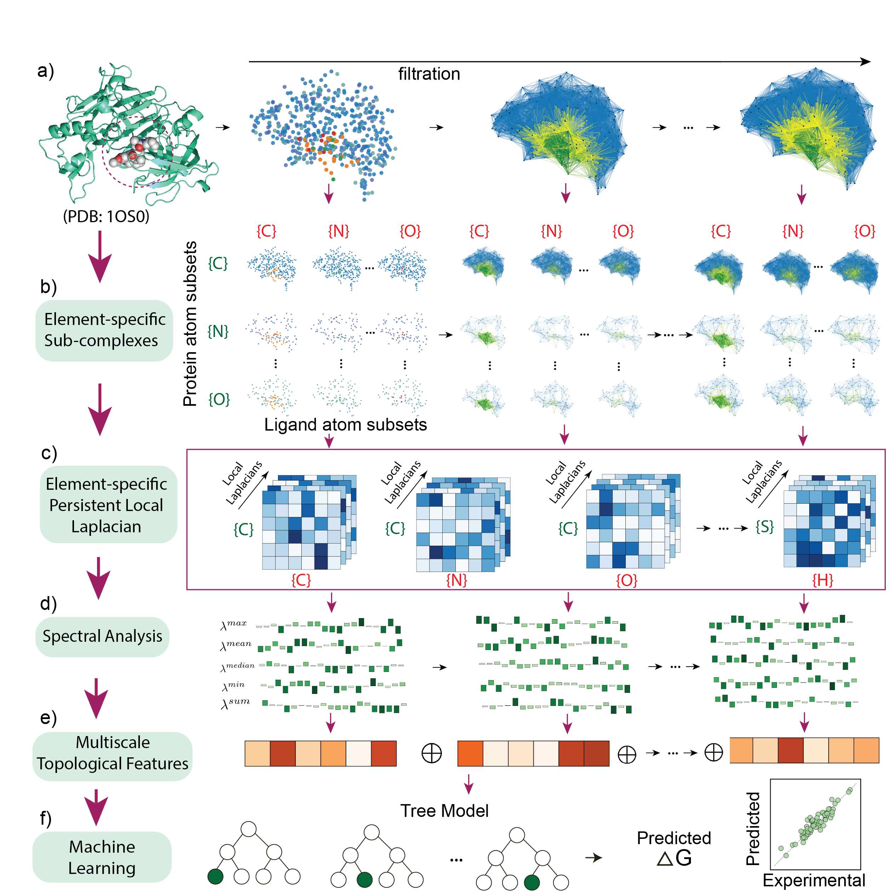

# PLLML

<div align='center'>
 
<!-- [](https://www.google.com/) -->
[](https://opensource.org/licenses/MIT)

</div>

**Title** - Persistent local Laplacian prediction of protein-ligand binding affinities.

**Authors** - Jian Liu and Hongsong Feng

---

## Table of Contents

- [Table of Contents](#table-of-contents)
- [Introduction](#introduction)
- [Model Architecture](#model-architecture)
- [Prerequisites](#prerequisites)
- [Visualization tools](#Visualization-tools)
- [Datasets](#datasets)
- [Modeling with PLL-based features](#Modeling-with-PLL-based-features)
    - [Generation of PLL-based features for protein-ligand complex](#II-Generation-of-mGLI-based-features-for-protein-ligand-complex)
    - [Generation of PLL-based features for small molecule](#III-Generation-of-PLL-based-features-for-small-molecule)

- [Results](#results)
    - [I. Modeling the PDBbind datasets]()
- [License](#license)
- [Citation](#citation)

---

## Introduction

Accurate prediction of protein–ligand binding affinity remains a central challenge in structure-based drug discovery. The effectiveness of machine learning models critically depends on the quality of molecular representations, for which advanced mathematical frameworks provide powerful tools. In this work, we employ a novel mathematical theory, termed the persistent local Laplacian (PLL), to construct molecular descriptors that capture localized geometric and topological features of biomolecular structures. The PLL framework addresses key limitations of traditional topological data analysis methods, such as persistent homology and the persistent Laplacian, which are often insensitive to local structural variations, while maintaining high computational efficiency. The resulting molecular descriptors are integrated with advanced machine learning algorithms to develop accurate predictive models for protein–ligand binding affinity. The proposed models are systematically evaluated on three well-established benchmark datasets including PDBbind-v2007, PDBbind-v2013, and PDBbind-v2016, demonstrating consistently strong and competitive predictive performance. Computational results show that the PLL-based models outperform existing approaches, highlighting their potential as a powerful tool for drug discovery, protein engineering, and broader applications in science and engineering.

> **Keywords**: Persistent Local Laplacian, Machine Learning, Protein–Ligand Binding Affinity

---

## Model Architecture

Schematic illustration of the overall persistent Local Laplacian platform for protein-ligand binding affinity prediction. The model architecture is shown in below.



Further explain the details in the [paper](https://arxiv.org/abs/2603.21503), providing context and additional information about the architecture and its components.

---

## Prerequisites

- numpy                     1.21.0
- scipy                     1.7.3
- scikit-learn              1.0.2
- python                    3.10.12
- biopandas                 0.4.1
- Biopython                 1.75

---

## Datasets

A brief introduction about the benchmarks.

| Datasets        | Total | Training Set | Test Set |
|----------------|-------|--------------|----------|
| PDBbind-v2007  | 1300  | 1105 [Label](datasets) | 195 [Label](datasets) |
| PDBbind-v2013  | 2959  | 2764 [Label](datasets) | 195 [Label](datasets) |
| PDBbind-v2016  | 4057  | 3767 [Label](datasets) | 290 [Label](datasets) |


- PDBbind RawData: the protein-ligand complex structures. Download from [PDBbind database](https://www.pdbbind-plus.org.cn/)
- Label: the .csv file, which contains the protein ID and corresponding binding affinity for PDBbind data.
---

## Modeling with PLL-based features

### I. Generation of PLL-based features for protein-ligand complex
Example with PDB 1c87, generating PLL features. 
Output: 1c87-complex-median-bin.npy
```shell
python codes/PLL_features.py --pdbid 1c87
```

### II. Generation of PLL-based features for small molecule
Example with the ligand in protein complex PDB 1c87, generating PLL features.
output: 1c87-ligand-median-bin.npy
```shell
python codes/PLL_features_ligand.py --pdbid 1c87
```

---

## Results

### II. Modeling the PDBbind datasets

#### 1. Modeling with PLL features
|Datasets                                        | Training Set                  | Test Set| PCC | RMSE (kcal/mol) |
|-------------------------------------------------|-------------                  |---------|-    |-                |
| PDBbind-v2007 [result](./results/PLL)      |1105| 195  | 0.813 |1.971|
| PDBbind-v2013 [result](./results/PLL)      |2764| 195  | 0.792 |1.976|
| PDBbind-v2016 [result](./results/PLL)      |3767| 290  | 0.850 |1.672|

#### 2. Modeling with \#{PLL,Transformer} features
|Datasets                                        | Training Set                  | Test Set| PCC | RMSE (kcal/mol) |
|-------------------------------------------------|-------------                  |---------|-    |-                |
| PDBbind-v2007 [result](./results/PLL-tf-consensus)      |1105| 195  | 0.827 |1.925|
| PDBbind-v2013 [result](./results/PLL-tf-consensus)      |2764| 195  | 0.813 | 1.932|
| PDBbind-v2016 [result](./results/PLL-tf-consensus)      |3767| 290  | 0.861 |1.646|


Note, twenty gradient boosting regressor tree (GBRT) models were built for each dataset with distinct random seeds such that initialization-related errors can be addressed. The PLL-based features and transformer-based features were paired with GBRT, respectively. The consensus predictions were obtained using predictions from the two types of models. The predictions can be found in the [results](./results) folder. 

---

## License

This project is licensed under the MIT License - see the [LICENSE](LICENSE) file for details.

---

## Citation

- Jian Liu and Hongsong Feng, "Persistent local Laplacian prediction of protein-ligand binding affinities"

---
